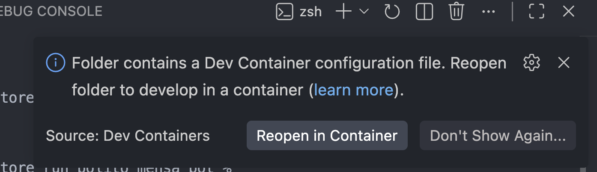
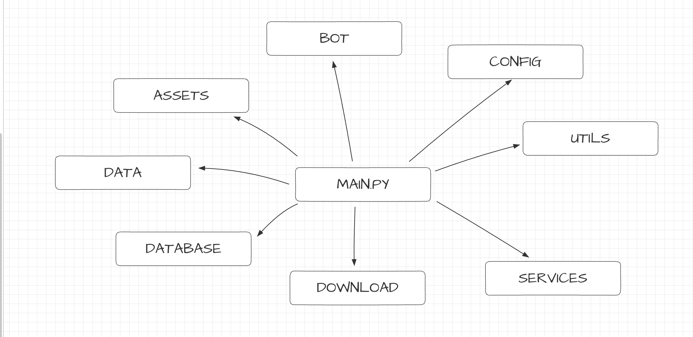
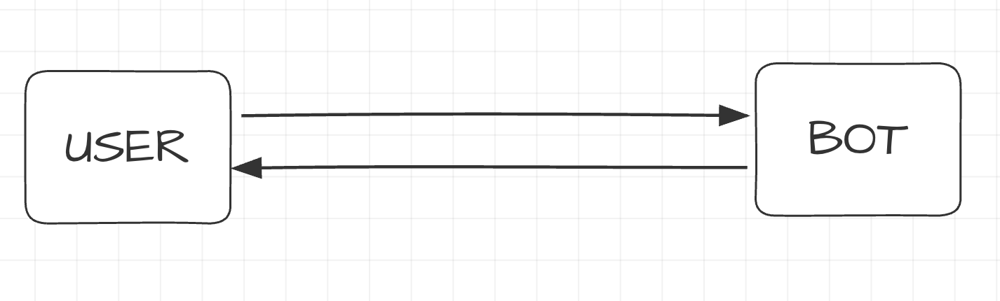
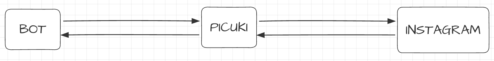
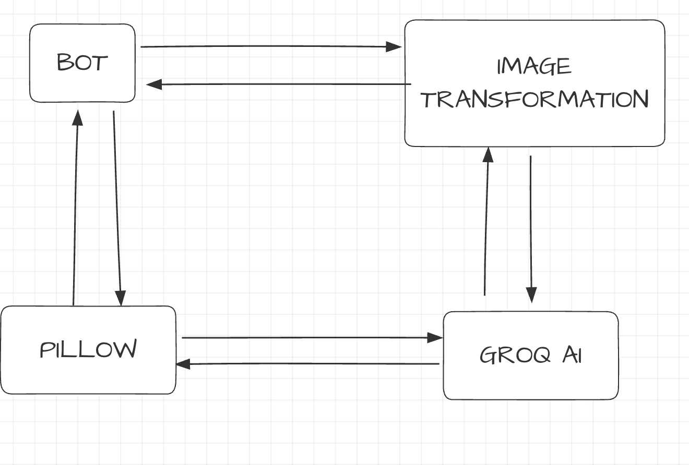

# HOW TO CONTRIBUTE TO RUN POLITO MENSA BOT

Hi mi folks, I’m [Salvatore Calò](https://www.linkedin.com/in/salvatorecalo/) one of the contributors of the bot.
Here is a quick guide to get started and contribute to the bot.

## Computer configuration
First you need to download **git** a powerful collaboration tool used by developers to manage code.

You can find the installation instructions [here](https://git-scm.com/install/)

Next, make sure you have **Python** installed on your machine. You can download it from the official [website](https://www.python.org/downloads/) or install it via package managers like Homebrew (on macOS):

```
brew install python
```
Once you have installed python check if you have installed it correctly by opening a terminal and typing
```
 python --version
```

Finally, you need to install Docker. It is essential for running the bot in an isolated development environment. You can download Docker Desktop from their official website.
Once you have installed it congratulations you can now start developing the bot!

## Configure the local environment
First you need to clone the repository

```
git clone https://github.com/salvatorecalo/run_polito_mensa_bot
```
Open the cloned folder in VS Code (or your favorite IDE). You will be prompted to open the project inside a development container. Click "Reopen in Container". VS Code will automatically follow the instructions in .devcontainer/devcontainer.json to build your environment.



## How it works behind the scene??
- **devcontainer.json**: tells vscode how to configure your IDE and extension inside Docker.
- **Dockerfile**: This is the blueprint of our environment. It contains all the step-by-step instructions (installing Linux packages, Python dependencies, Tesseract OCR, and Playwright browsers). Docker runs these instructions identically on every machine. That's the magic: it works on your machine, on my machine, and on the server!
- **docker-compose.yml**: This friend of Docker is used to manage the container setup, handle persistent storage deployment (so we don't lose our SQLite database file), and pass environment variables securely.

Now that your environment is fully up and running, you are ready to explore the codebase and start coding!

## Bot structure
You can imagine the bot structure as a lot of boxes that communicate together

in the main.py you will the main commands you run the bot and configurations

**bot/** folder is where you will every command that users and admin of the bot can do

**config/** folder is where you will a set of constants and settings used across files

**data** folder contains the database file bot.db (do not worry if you lose it, the bot will create it from zero if it not find the file) and debug_error.png if something goes wrong for example in the web scraper

**download** this is where the image downloaded from the middleware goes

in **utils** folder there is some utility function that we use across the project like today date, translate_text or logger!

I can't tell you the content of every file, but you can give a read and ask me if there is any trouble

But let's started about the user flow

Users can send messages to bot on telegram and the command handler of the bot recognize if it's a command or not and if yes reply to it with the function defined in bot/handle_callback.py

Every day at a certain hours the bot do a task, which is ask instagram in there edisu published any stories. We tried to ask directly instagram with some tools, but it was a caos instagram shadow ban us istantly so we decided to pass by a middleware which is a downloader instagram story website (in our case picuki)


Once it download every image by a scraper, in our case we use playwright to simulate a browser since picuki dinamically load images with javascript.
We apply some transformations to it, so our ai model can better extract text from it.

We tried to use pytesseract ocr but it was too stupid and misses letters or words

Example of image transformation

After that pillow create a new image in every supported language and send it to user

At the start of the project we used gitflow, but since Stefano abbandoned me and I was the only developer I started pushing on main, wihout create a issue and a merge request every time